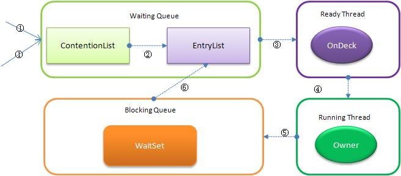

# [Synchronized原理](http://blog.csdn.net/chen77716/article/details/6618779)

在多线程并发编程中`Synchronized`一直是元老级角色，很多人都会称呼它为重量级锁，但是随着`Java SE1.6`对`Synchronized`进行了各种优化之后，有些情况下它并不那么重了，本文详细介绍了`Java SE1.6`中为了减少获得锁和释放锁带来的性能消耗而引入的偏向锁和轻量级锁，以及锁的存储结构和升级过程。

CAS(Compare and Swap)，用于在硬件层面上提供原子性操作。在 Intel 处理器中，比较并交换通过指令`cmpxchg`实现。比较是否和给定的数值一致，如果一致则修改，不一致则不修改。

## 基础

Java中的每一个对象都可以作为锁。

  - 对于同步方法，锁是当前实例对象。
  - 对于静态同步方法，锁是当前对象的Class对象。
  - 对于同步方法块，锁是`Synchonized`括号里配置的对象。

当一个线程试图访问同步代码块时，它首先必须得到锁，退出或抛出异常时必须释放锁。那么锁存在哪里呢？锁里面会存储什么信息呢？

## 同步的原理

JVM规范规定JVM基于进入和退出 `Monitor` 对象来实现方法同步和代码块同步，但两者的实现细节不一样。代码块同步是使用`monitorenter`和`monitorexit`指令实现，而方法同步是使用另外一种方式实现的，细节在JVM规范里并没有详细说明，但是方法的同步同样可以使用这两个指令来实现。

`monitorenter`指令是在编译后插入到同步代码块的开始位置，而`monitorexit`是插入到方法结束处和异常处，JVM要保证每个`monitorenter`必须有对应的`monitorexit`与之配对。任何对象都有一个`monitor`与之关联，当且一个`monitor`被持有后，它将处于锁定状态。线程执行到 `monitorenter` 指令时，将会尝试获取对象所对应的 `monitor` 的所有权，即尝试获得对象的锁。

### Java对象头

锁存在Java对象头里。如果对象是数组类型，则虚拟机用3个Word（字宽）存储对象头，如果对象是非数组类型，则用2字宽存储对象头。在32位虚拟机中，一字宽等于四字节，即32bit。

| 长度     | 内容     | 说明        |
| :------------- | :------------- | :------------- |
|32/64bit|	Mark Word	|存储对象的hashCode或锁信息等|
|32/64bit|	Class Metadata Address	|存储到对象类型数据的指针|
|32/64bit|	Array length	|数组的长度（如果当前对象是数组）|

Java对象头里的`Mark Word`里默认存储对象的`HashCode`，分代年龄和锁标记位。32位JVM的`Mark Word`的默认存储结构如下：

|   \   | 25 bit    |4bit|1bit是否是偏向锁|2bit锁标志位|
| :------------- | :------------- | :------------- | :------------- | :------------- |
|无锁状态|	对象的hashCode|	对象分代年龄|	0|	01|

在运行期间`Mark Word`里存储的数据会随着锁标志位的变化而变化。`Mark Word`可能变化为存储以下4种数据：

### 锁的升级

Java SE1.6为了减少获得锁和释放锁所带来的性能消耗，引入了“偏向锁”和“轻量级锁”，所以在Java SE1.6里锁一共有四种状态，`无锁状态`，`偏向锁状态`，`轻量级锁状态`和`重量级锁状态`，它会随着竞争情况逐渐升级。**锁可以升级但不能降级，意味着偏向锁升级成轻量级锁后不能降级成偏向锁。这种锁升级却不能降级的策略，目的是为了提高获得锁和释放锁的效率**。

## 线程对锁的竞争

当多个线程同时请求某个对象监视器时，对象监视器会设置几种状态用来区分请求的线程：

  - `Contention List`：所有请求锁的线程将被首先放置到该竞争队列
  - `Entry List`：Contention List中那些有资格成为候选人的线程被移到Entry List
  - `Wait Set`：那些调用wait方法被阻塞的线程被放置到Wait Set
  - `OnDeck`：任何时刻最多只能有一个线程正在竞争锁，该线程称为OnDeck
  - `Owner`：获得锁的线程称为Owner
  - `!Owner`：释放锁的线程

当多个线程同时访问一段同步代码时，首先会进入 `_EntryList` 集合，当线程获取到对象的 `monitor` 后进入 `_Owner` 区域并把 `monitor` 中的 `owner` 变量设置为当前线程同时 `monitor` 中的计数器 `count` 加 1，若线程调用 `wait()` 方法，将释放当前持有的 `monitor` ， `owner` 变量恢复为 `null` ， `count` 自减1，同时该线程进入 `WaitSet` 集合中等待被唤醒。若当前线程执行完毕也将释放 `monitor`(锁)并复位变量的值，以便其他线程进入获取 `monitor`(锁)。

### ContentionList

`ContentionList`并不是一个真正的Queue，而只是一个虚拟队列，原因在于`ContentionList`是由 Node 及其 next 指针逻辑构成，并不存在一个 `Queue` 的数据结构。`ContentionList`是一个后进先出（LIFO）的队列，每次新加入 `Node` 时都会在队头进行，通过 `CAS` 改变第一个节点的的指针为新增节点，同时设置新增节点的 `next` 指向后续节点，而取得操作则发生在队尾。显然，该结构其实是个`Lock-Free`的队列。

因为只有Owner线程才能从队尾取元素，也即线程出列操作无争用，当然也就避免了CAS的ABA问题。

### EntryList

`EntryList`与`ContentionList`逻辑上同属等待队列，`ContentionList`会被线程并发访问，为了降低对`ContentionList`队尾的争用，而建立`EntryList`。**Owner线程在unlock时会从ContentionList中迁移线程到EntryList，并会指定EntryList中的某个线程（一般为Head）为Ready（OnDeck）线程。Owner线程并不是把锁传递给OnDeck线程，只是把竞争锁的权利交给OnDeck，OnDeck线程需要重新竞争锁**。这样做虽然牺牲了一定的公平性，但极大的提高了整体吞吐量，在Hotspot中把OnDeck的选择行为称之为“竞争切换”。

`OnDeck`线程获得锁后即变为owner线程，无法获得锁则会依然留在`EntryList`中，考虑到公平性，在`EntryList`中的位置不发生变化（依然在队头）。如果`Owner`线程被wait方法阻塞，则转移到`WaitSet`队列；如果在某个时刻被`notify/notifyAll`唤醒，则再次转移到`EntryList`。
