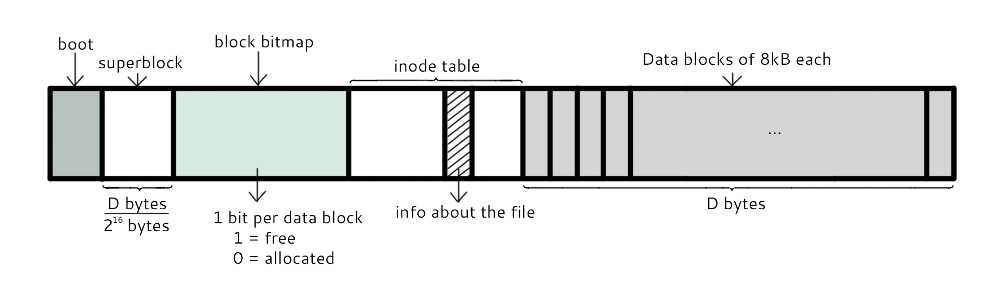

# 四、文件系统

## 分区与文件系统

对分区进行格式化是为了在分区上建立文件系统。一个分区通常只能格式化为一个文件系统，但是磁盘阵列等技术可以将一个分区格式化为多个文件系统。

## 组成

最主要的几个组成部分如下：

- inode：一个文件占用一个 inode，记录文件的属性，同时记录此文件的内容所在的 block 编号；
- block：记录文件的内容，文件太大时，会占用多个 block。

除此之外还包括：

- superblock：记录文件系统的整体信息，包括 inode 和 block 的总量、使用量、剩余量，以及文件系统的格式与相关信息等；
- block bitmap：记录 block 是否被使用的位域。

## 文件读取

对于 Ext2 文件系统，当要读取一个文件的内容时，先在 inode 中去查找文件内容所在的所有 block，然后把所有 block 的内容读出来。

而对于 FAT 文件系统，它没有 inode，每个 block 中存储着下一个 block 的编号。

## 磁盘碎片

指一个文件内容所在的 block 过于分散，导致磁盘磁头移动距离过大，从而降低磁盘读写性能。

## block

在 Ext2 文件系统中所支持的 block 大小有 1K，2K 及 4K 三种，不同的大小限制了单个文件和文件系统的最大大小。

| 大小 | 1KB | 2KB | 4KB |
| :---: | :---: | :---: | :---: |
| 最大单一文件 | 16GB | 256GB | 2TB |
| 最大文件系统 | 2TB | 8TB | 16TB |

一个 block 只能被一个文件所使用，未使用的部分直接浪费了。因此如果需要存储大量的小文件，那么最好选用比较小的 block。

## inode

inode 具体包含以下信息：

- 权限 (read/write/excute)；
- 拥有者与群组 (owner/group)；
- 容量；
- 建立或状态改变的时间 (ctime)；
- 最近一次的读取时间 (atime)；
- 最近修改的时间 (mtime)；
- 定义文件特性的旗标 (flag)，如 SetUID...；
- 该文件真正内容的指向 (pointer)。

inode 具有以下特点：

- 每个 inode 大小均固定为 128 bytes (新的 ext4 与 xfs 可设定到 256 bytes)；
- 每个文件都仅会占用一个 inode。

inode 中记录了文件内容所在的 block 编号，但是每个 block 非常小，一个大文件随便都需要几十万的 block。而一个 inode 大小有限，无法直接引用这么多 block 编号。因此引入了间接、双间接、三间接引用。间接引用是指，让 inode 记录的引用 block 块记录引用信息。

## 目录

建立一个目录时，会分配一个 inode 与至少一个 block。block 记录的内容是目录下所有文件的 inode 编号以及文件名。

可以看出文件的 inode 本身不记录文件名，文件名记录在目录中，因此新增文件、删除文件、更改文件名这些操作与目录的 w 权限有关。

## 日志

如果突然断电，那么文件系统会发生错误，例如断电前只修改了 block bitmap，而还没有将数据真正写入 block 中。

ext3/ext4 文件系统引入了日志功能，可以利用日志来修复文件系统。

## 挂载

挂载利用目录作为文件系统的进入点，也就是说，进入目录之后就可以读取文件系统的数据。

## 目录配置

为了使不同 Linux 发行版本的目录结构保持一致性，Filesystem Hierarchy Standard (FHS) 规定了 Linux 的目录结构。最基础的三个目录如下：

- / (root, 根目录)
- /usr (unix software resource)：所有系统默认软件都会安装到这个目录；
- /var (variable)：存放系统或程序运行过程中的数据文件。

# 参考资料

- 鸟哥. 鸟 哥 的 Linux 私 房 菜 基 础 篇 第 三 版[J]. 2009.
- [Linux 平台上的软件包管理](https://www.ibm.com/developerworks/cn/linux/l-cn-rpmdpkg/index.html)
- [Linux 之守护进程、僵死进程与孤儿进程](http://liubigbin.github.io/2016/03/11/Linux-%E4%B9%8B%E5%AE%88%E6%8A%A4%E8%BF%9B%E7%A8%8B%E3%80%81%E5%83%B5%E6%AD%BB%E8%BF%9B%E7%A8%8B%E4%B8%8E%E5%AD%A4%E5%84%BF%E8%BF%9B%E7%A8%8B/)
- [What is the difference between a symbolic link and a hard link?](https://stackoverflow.com/questions/185899/what-is-the-difference-between-a-symbolic-link-and-a-hard-link)
- [Linux process states](https://idea.popcount.org/2012-12-11-linux-process-states/)
- [GUID Partition Table](https://en.wikipedia.org/wiki/GUID_Partition_Table)
- [详解 wait 和 waitpid 函数](https://blog.csdn.net/kevinhg/article/details/7001719)
- [IDE、SATA、SCSI、SAS、FC、SSD 硬盘类型介绍](https://blog.csdn.net/tianlesoftware/article/details/6009110)
- [Akai IB-301S SCSI Interface for S2800,S3000](http://www.mpchunter.com/s3000/akai-ib-301s-scsi-interface-for-s2800s3000/)
- [Parallel ATA](https://en.wikipedia.org/wiki/Parallel_ATA)
- [ADATA XPG SX900 256GB SATA 3 SSD Review – Expanded Capacity and SandForce Driven Speed](http://www.thessdreview.com/our-reviews/adata-xpg-sx900-256gb-sata-3-ssd-review-expanded-capacity-and-sandforce-driven-speed/4/)
- [Decoding UCS Invicta – Part 1](https://blogs.cisco.com/datacenter/decoding-ucs-invicta-part-1)
- [硬盘](https://zh.wikipedia.org/wiki/%E7%A1%AC%E7%9B%98)
- [Difference between SAS and SATA](http://www.differencebetween.info/difference-between-sas-and-sata)
- [BIOS](https://zh.wikipedia.org/wiki/BIOS)
- [File system design case studies](https://www.cs.rutgers.edu/\~pxk/416/notes/13-fs-studies.html)
- [Programming Project #4](https://classes.soe.ucsc.edu/cmps111/Fall08/proj4.shtml)
- [FILE SYSTEM DESIGN](http://web.cs.ucla.edu/classes/fall14/cs111/scribe/11a/index.html)

