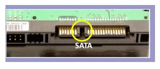

# 二、磁盘

## 磁盘接口

### 1. IDE

IDE（ATA）全称 Advanced Technology Attachment，接口速度最大为 133MB/s，因为并口线的抗干扰性太差，且排线占用空间较大，不利电脑内部散热，已逐渐被 SATA 所取代。

### 2. SATA

SATA 全称 Serial ATA，也就是使用串口的 ATA 接口，抗干扰性强，且对数据线的长度要求比 ATA 低很多，支持热插拔等功能。SATA-II 的接口速度为 300MiB/s，而新的 SATA-III 标准可达到 600MiB/s 的传输速度。SATA 的数据线也比 ATA 的细得多，有利于机箱内的空气流通，整理线材也比较方便。

### 3. SCSI

SCSI 全称是 Small Computer System Interface（小型机系统接口），经历多代的发展，从早期的 SCSI-II 到目前的 Ultra320 SCSI 以及 Fiber-Channel（光纤通道），接口型式也多种多样。SCSI 硬盘广为工作站以及个人电脑以及服务器所使用，因此会使用较为先进的技术，如碟片转速 15000rpm 的高转速，且传输时 CPU 占用率较低，但是单价也比相同容量的 ATA 及 SATA 硬盘更加昂贵。

### 4. SAS

SAS（Serial Attached SCSI）是新一代的 SCSI 技术，和 SATA 硬盘相同，都是采取序列式技术以获得更高的传输速度，可达到 6Gb/s。此外也通过缩小连接线改善系统内部空间等。

## 磁盘的文件名

Linux 中每个硬件都被当做一个文件，包括磁盘。磁盘以磁盘接口类型进行命名，常见磁盘的文件名如下：

- IDE 磁盘：/dev/hd[a-d]
- SATA/SCSI/SAS 磁盘：/dev/sd[a-p]

其中文件名后面的序号的确定与系统检测到磁盘的顺序有关，而与磁盘所插入的插槽位置无关。

# 参考资料

- 鸟哥. 鸟 哥 的 Linux 私 房 菜 基 础 篇 第 三 版[J]. 2009.
- [Linux 平台上的软件包管理](https://www.ibm.com/developerworks/cn/linux/l-cn-rpmdpkg/index.html)
- [Linux 之守护进程、僵死进程与孤儿进程](http://liubigbin.github.io/2016/03/11/Linux-%E4%B9%8B%E5%AE%88%E6%8A%A4%E8%BF%9B%E7%A8%8B%E3%80%81%E5%83%B5%E6%AD%BB%E8%BF%9B%E7%A8%8B%E4%B8%8E%E5%AD%A4%E5%84%BF%E8%BF%9B%E7%A8%8B/)
- [What is the difference between a symbolic link and a hard link?](https://stackoverflow.com/questions/185899/what-is-the-difference-between-a-symbolic-link-and-a-hard-link)
- [Linux process states](https://idea.popcount.org/2012-12-11-linux-process-states/)
- [GUID Partition Table](https://en.wikipedia.org/wiki/GUID_Partition_Table)
- [详解 wait 和 waitpid 函数](https://blog.csdn.net/kevinhg/article/details/7001719)
- [IDE、SATA、SCSI、SAS、FC、SSD 硬盘类型介绍](https://blog.csdn.net/tianlesoftware/article/details/6009110)
- [Akai IB-301S SCSI Interface for S2800,S3000](http://www.mpchunter.com/s3000/akai-ib-301s-scsi-interface-for-s2800s3000/)
- [Parallel ATA](https://en.wikipedia.org/wiki/Parallel_ATA)
- [ADATA XPG SX900 256GB SATA 3 SSD Review – Expanded Capacity and SandForce Driven Speed](http://www.thessdreview.com/our-reviews/adata-xpg-sx900-256gb-sata-3-ssd-review-expanded-capacity-and-sandforce-driven-speed/4/)
- [Decoding UCS Invicta – Part 1](https://blogs.cisco.com/datacenter/decoding-ucs-invicta-part-1)
- [硬盘](https://zh.wikipedia.org/wiki/%E7%A1%AC%E7%9B%98)
- [Difference between SAS and SATA](http://www.differencebetween.info/difference-between-sas-and-sata)
- [BIOS](https://zh.wikipedia.org/wiki/BIOS)
- [File system design case studies](https://www.cs.rutgers.edu/\~pxk/416/notes/13-fs-studies.html)
- [Programming Project #4](https://classes.soe.ucsc.edu/cmps111/Fall08/proj4.shtml)
- [FILE SYSTEM DESIGN](http://web.cs.ucla.edu/classes/fall14/cs111/scribe/11a/index.html)

